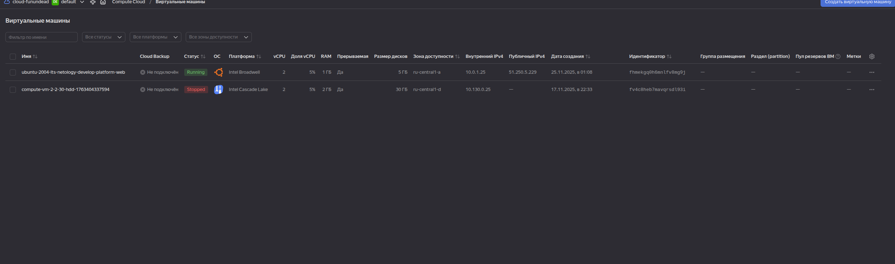
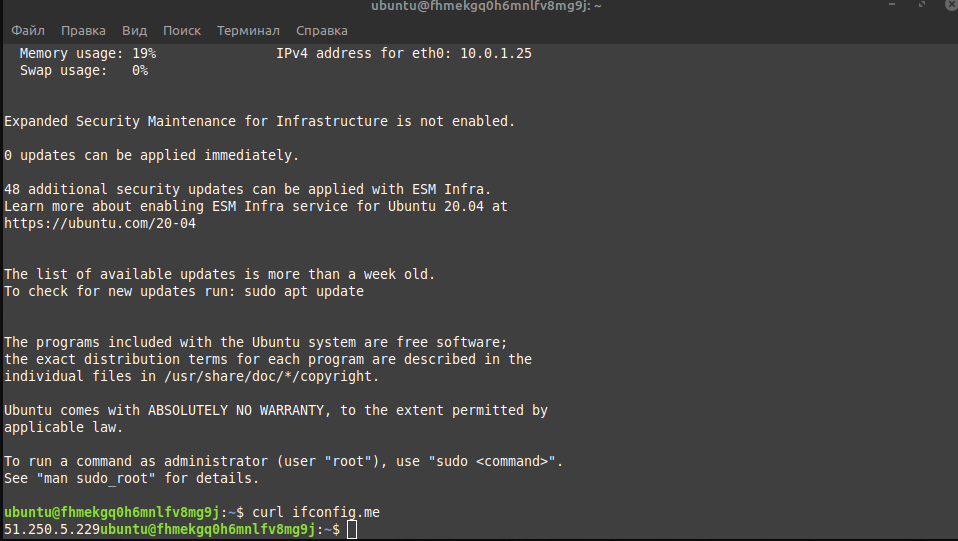
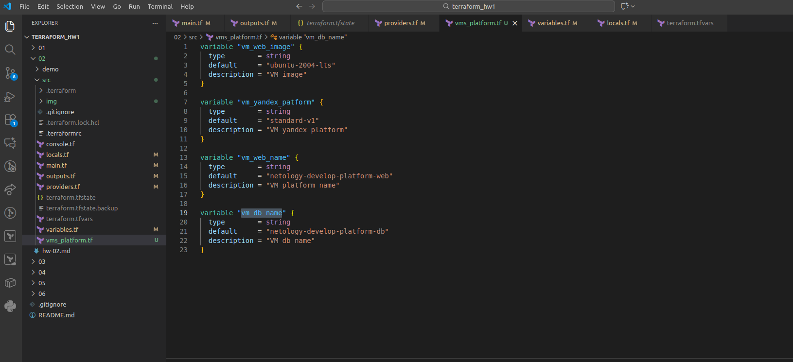
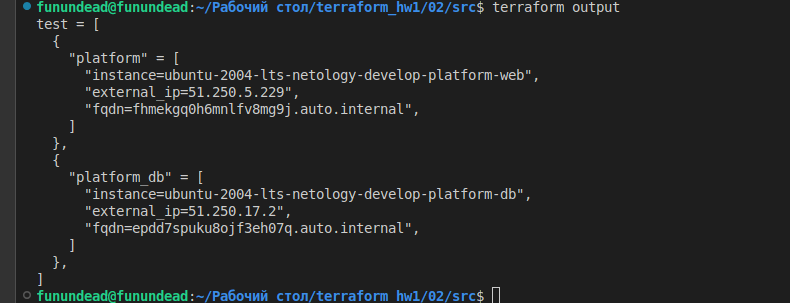

### Задание 1

`preemptible = true` параметр отключает ВМ через 24 часа.
`core_fraction=5` использует 5% процессорного времени.
Это позволяет экономить финансовые ресурсы.

### Задание 2

### Задание 3

### Задание 4

### Задание 5

### Задание 6

код расположен в каталоге 02/src